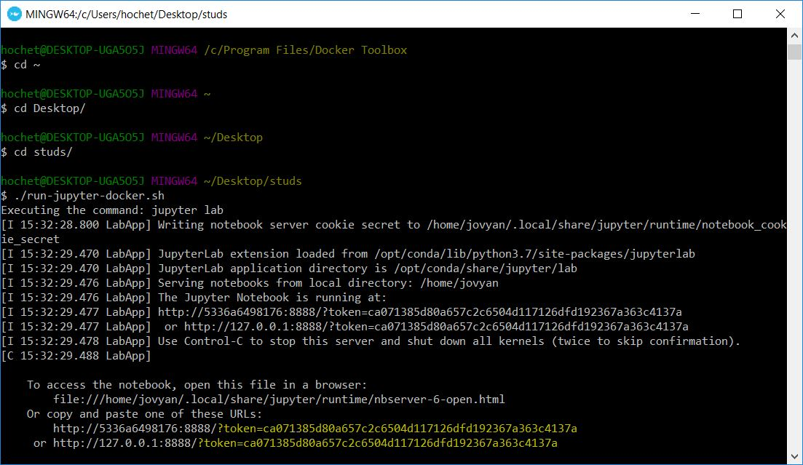

# Instructions

* Install Docker if you don't have it yet
* Run `./run-jupyter-docker.sh` to launch the docker run process
* Once your script finished launching your container, it will display two URLs, that's because Jupyter Lab requires an authentication token to access it. This token is in the URL, just copy it and past it in your `localhost` URL. Note that on windows, using Docker Machine, your URL will be of the form `192.168.99.100:8888`. 

* Once logged in Jupyter Lab you will have access to its interface. Just open the `notebooks` directory to see what notebooks are available, we put the instructions in each notebooks. To open a `.md` notebook: Right click on the notebook -> Open With -> Notebook
* Do not forget to save your work form time to time!

# How to submit your lab?
The notebooks are automatically saved in the `notebooks` directory from the host OS, where the `run-jupyter-docker.sh` script is, you can then submit the notebook file itself (both the `.ipynb` and `.md`).

# I can't run my notebooks because I'm low on RAM
This problem was encountered before on OS X, the solution we found was simply to increase the max available memory in your docker preferences. This is because the JVM, by default, take 1/4 of all available memory.
